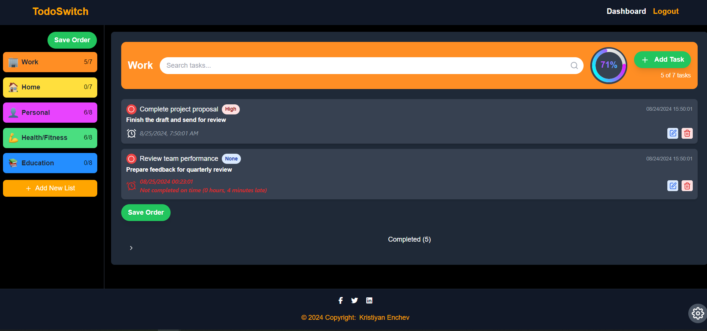

# TodoSwitch

## 🏗️ Clean Architecture & Domain-Driven Design

TodoSwitch is a robust task management system, crafted with **.NET 7** on the backend and **React 18** on the frontend. Leveraging **Clean Architecture** and **Domain-Driven Design (DDD)**, this project is structured for scalability and maintainability. It’s containerized with **Docker** and serves the UI through **Nginx**.

<p align="center">
    
</p>

## 👀 Try it out

```bash
git clone https://github.com/KristiyanEnchev/TodoSwitch.git
```
```bash
cd TodoSwitch/
```
```bash
cp .env.example .env
```
```bash
docker-compose up --build -d
```

## 🛠 Configuration

- **MongoDB** - Username: admin , Password: admin
- **Default Account** - Email: admin@admin.com, Password: 123456
- **API URL** - http://localhost:5069/
- **UI URL** - http://localhost:5173/

## 👷 Built with

### Backend:

- [.NET Core 7.0](https://github.com/dotnet/core)
- [ASP.NET Core 7.0](https://github.com/dotnet/aspnetcore)
- [FluentValidation](https://github.com/FluentValidation/FluentValidation)
- [AutoMapper](https://github.com/AutoMapper/AutoMapper)
- [CQRS & MediatR](https://github.com/jbogard/MediatR)
- [Serilog](https://github.com/serilog/serilog)
- [MongoDB](https://github.com/mongodb/mongo)
- **xUnit, Shouldly, Moq (Testing)**
- **Cache & Background Jobs**

### Frontend:

- [React 18](https://reactjs.org/)
- [Vite](https://vitejs.dev/)
- [TailwindCSS](https://tailwindcss.com/)
- [FramerMotion](https://github.com/framer/motion)
- [Redux Toolkit](https://github.com/reduxjs/redux-toolkit)
- [Redux Toolkit Query](https://github.com/reduxjs/redux-toolkit)
- [React Router Dom](https://reactrouter.com/)
- [FontAwesome](https://fontawesome.com/)
- [Zod](https://github.com/colinhacks/zod)

### DevOps:

- **Docker & Docker Compose**: Containerization and orchestration.
- **Nginx**: High-performance web server and reverse proxy.

## ✏️ License

This project is licensed under the MIT License - see the [LICENSE](LICENSE) file for details

## 👨‍🚀 Show your support

Give a ⭐ if you like this project!

## 🧍‍♂️️ Author

[](https://www.facebook.com/kristiqn.enchev.5/) [](https://www.instagram.com/kristiyan_e/) [](mailto:kristiqnenchevv@gmail.com)
